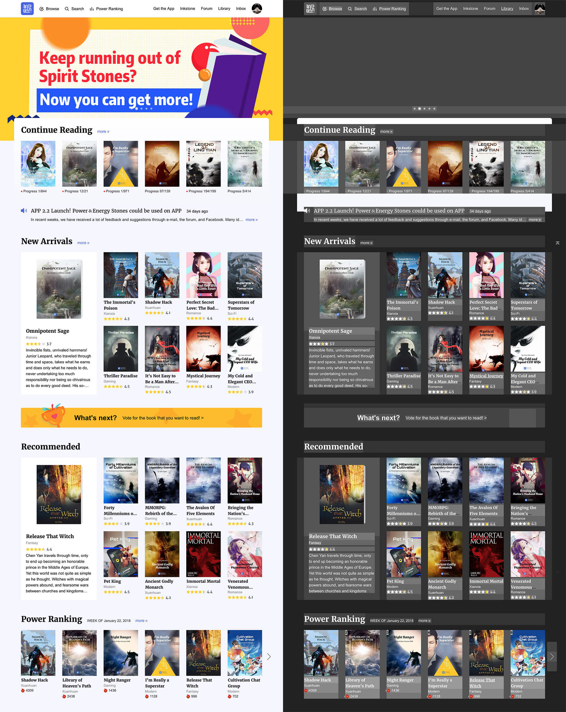
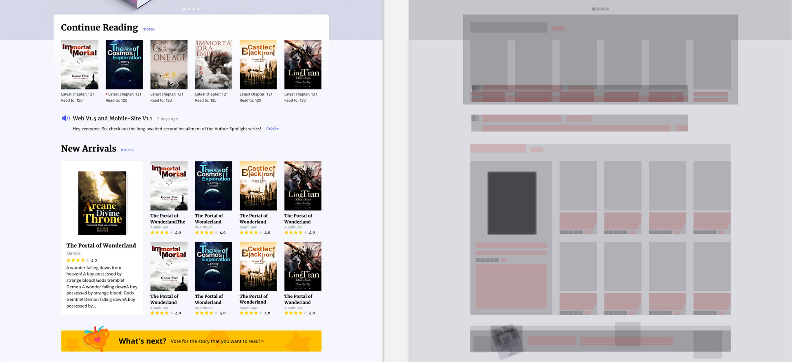

# Sketch Topographic

Display Topographic Information.

## webdeveloper extension

Ideas form chrome extension [webdeveloper](https://chrome.google.com/webstore/detail/web-developer/bfbameneiokkgbdmiekhjnmfkcnldhhm?hl=zh-CN).

When you choose the `Display Topographic Information` you can see the structure of the page like below. That can check your page is align well like what you want.

It is a amazing function. So I try to make a Sketch vision like the wonderful extention. 

## What I did in this sketch plugin?

Foreach layers except the `symbol` element.

`ctrl alt cmd t`

show the frame with a `rgba(0,0,0,0.1)` shape

`ctrl alt cmd b`

show the frame with a `rgba(0,255,255,0.8)` border

`ctrl alt cmd z`

clear all

## further more

* In our team, we highly recommend that each text should be a shared text style. If there is a text without shared text style the gray shape or the blue line will turn out to be red. 
* When the text layer `Height%lightHeight!=0` it is error too. 

Of course you can ignore all the rule when your layer name with a `_` start.
